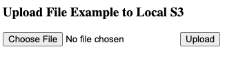
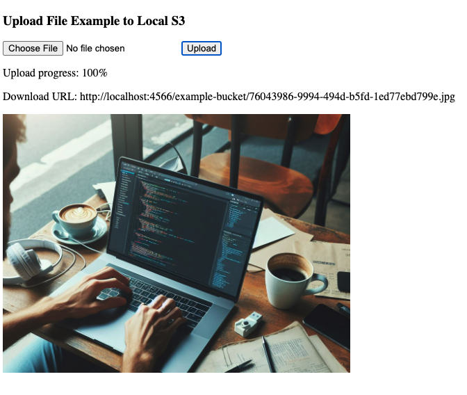

# Upload S3 Example

Project ini berisi contoh implementasi bagaimana melakukan secure file upload pada S3 dengan menggunakan presigned URL menggunakan NodeJS.

Namun pada project ini kita tidak akan mengupload file pada S3 bucket yang asli, melainkan pada S3 bucket yang di spawn secara local di komputer kita oleh LocalStack.

## Cara Menjalankan

Ketik perintah berikut di terminal:

```
make run
```

Jika semuanya berjalan dengan baik, setelah beberapa saat akan muncul tulisan seperti berikut:

```
local-server-1      | Server started at http://localhost:8080
```

Buka http://localhost:8080 di browser dan kamu akan menemukan tampilan seperti berikut:



Cobalah untuk mengupload sebuah gambar JPG. Kalau berhasil, kamu akan mendapatkan tampilan sebagai berikut:



File gambar yang kamu upload akan disimpan pada S3 bucket local yang di spawn oleh LocalStack. 🎉